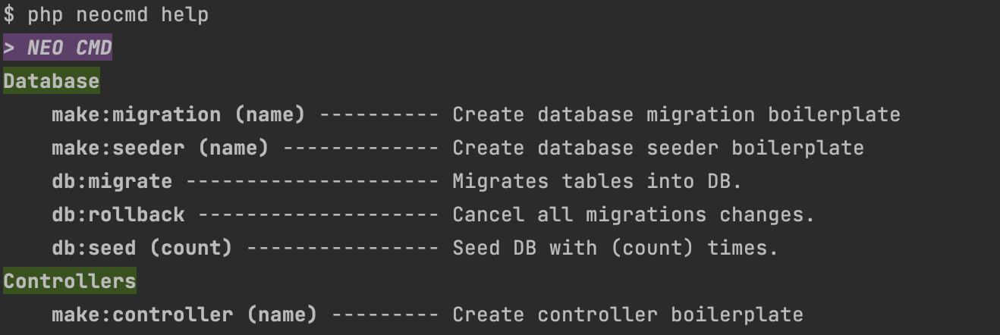

# NEO Framework

Welcome, friend! This is my project, designed specifically to be included in a CV as a demonstration of my skills. I purposely didn’t use any third-party libraries to showcase pure development abilities.

I enjoy working with the Laravel framework, so this project has similarities to it. In fact, it could even be considered a stripped-down version of Laravel.

It includes the minimum functionality necessary for developing a standard web application.

### Quick set-up (30sec)
1. `git clone https://github.com/wemmbley/neo.git neo`
2. `make up` (or `docker-compose up`)
3. `make shell` (or `docker-compose exec php-fpm sh`)
4. `composer install`
5. `php neocmd db:migrate`
6. `php neocmd db:seed 20`

Site: http://localhost:11000/

### Features:
- Controllers
- Query Builder
- Migrations
- Seeders
- Routing
- Blade-like template engine
- Artisan-like console
- CSRF form protector
- A many useful helpers

### NEO CMD
To call console type `php neocmd help` in project root.

> [!CAUTION]
> I am not implemented any validation in the console, so you need to be careful with arguments that you pass to this console.