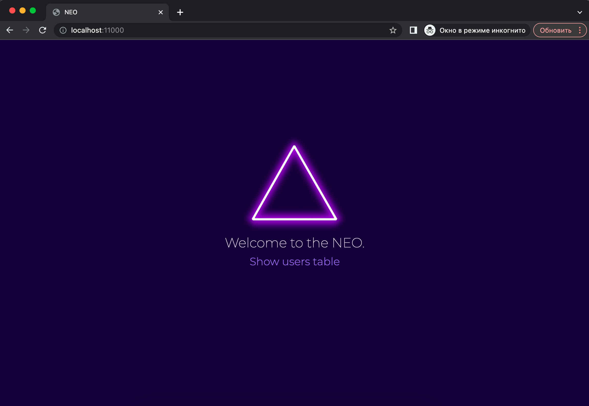
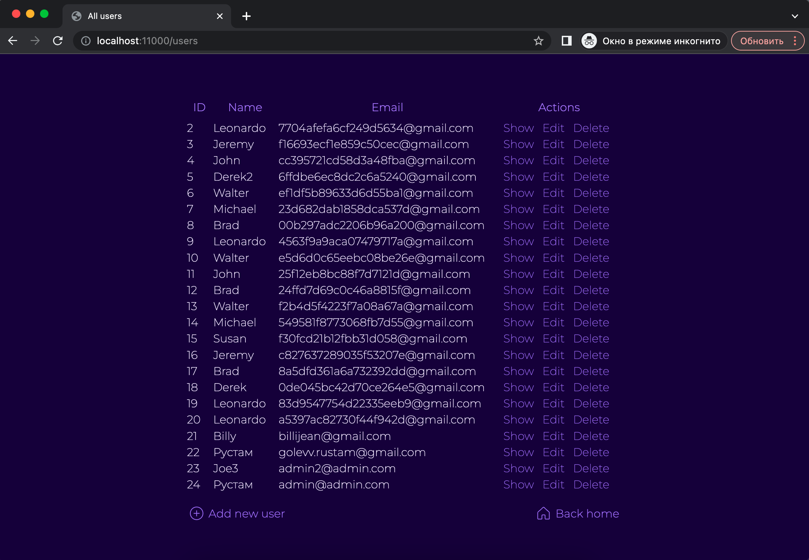
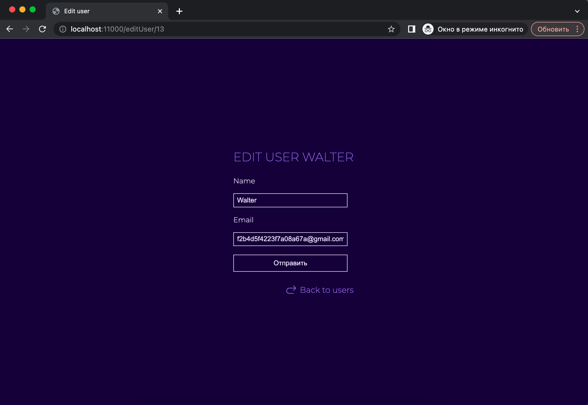
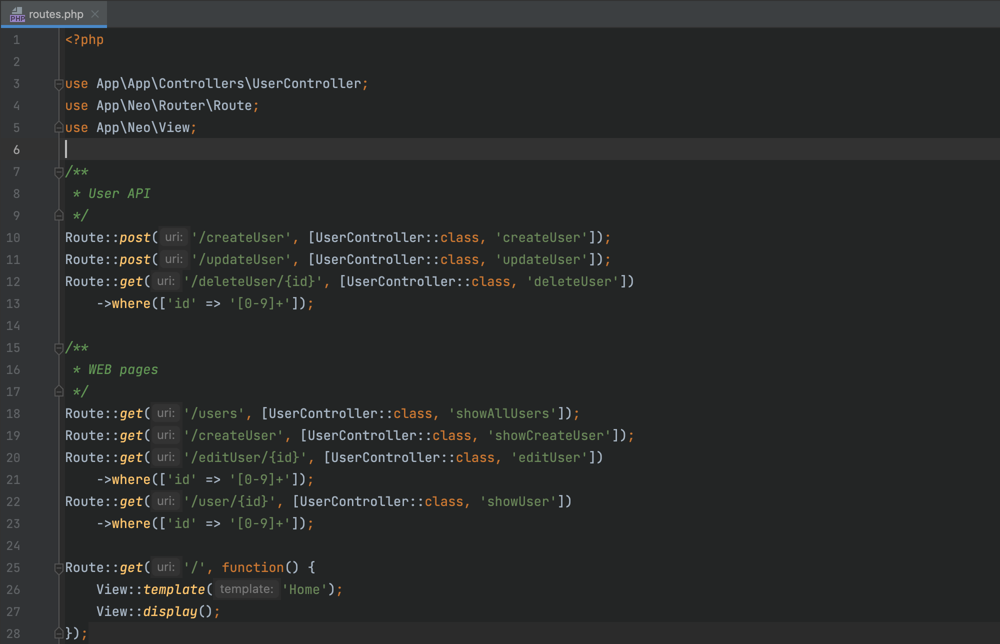

# NEO

## Structure
- app - here all app files
- neo - here framework
- public - resources, storage, uploads

# Demo CRUD
I made a simple CRUD as a test project. Screenshots can be seen below.

## Home page

## CRUD page

## Edit page

## Routes

