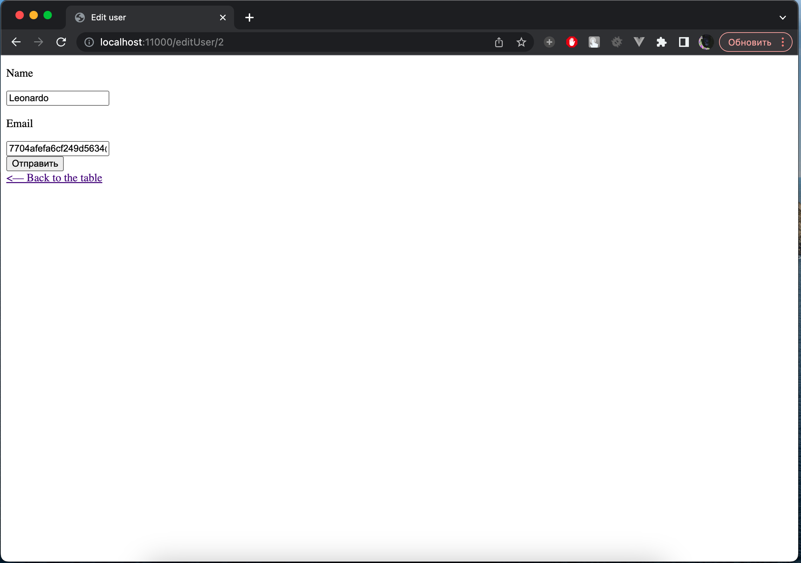
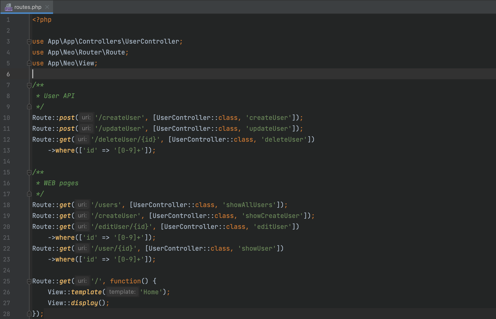

# Structure
- app - here all app files
- neo - here framework
- public - index.php, uploads, etc.

- --

# Test project
I made a simple CRUD as a test project without any CSS. Screenshots can be seen below

Edit page

Routes

